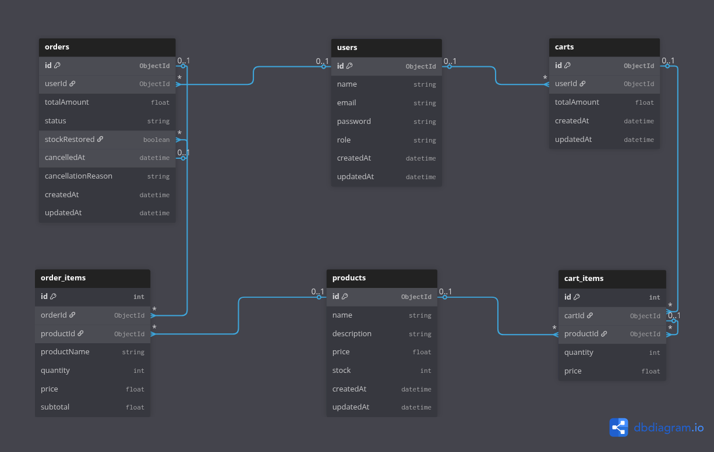

# Mini E-Commerce API

A RESTful backend API for a basic online shopping platform, handling authentication, product management, cart operations, and order processing with proper business logic and data consistency.

**Live API:**   
**Swagger Docs:** 

---

## Tech Stack

| | |
|---|---|
| Runtime | Node.js v18+ |
| Language | TypeScript 5.9 |
| Framework | Express.js 5 |
| Database | MongoDB 7 + Mongoose 9 |
| Validation | Zod 4 |
| Auth | JWT (access + refresh tokens) with HTTP-only cookies |
| Security | Helmet, CORS, express-rate-limit, bcryptjs |
| Logging | Winston + Morgan |
| Docs | Swagger UI (OpenAPI 3.0) |

---

## Getting Started

### Prerequisites

- Node.js v18+
- MongoDB running locally (or a MongoDB Atlas connection string)
- npm v9+

> **Note:** This project uses **Express 5**, **Mongoose 9**, and **Zod 4** - all major versions with breaking changes from their predecessors. Downgrading them any occur problems.

### Installation

```bash
git clone https://github.com/rifah07/mini-ecommerce-api.git
cd mini-ecommerce-api
npm install
cp .env.example .env
```

Open `.env` and fill in the required values. You need two separate JWT secrets — generate them with:

```bash
node -e "console.log(require('crypto').randomBytes(64).toString('hex'))"
```

Run the command twice and use each output for `JWT_SECRET` and `JWT_REFRESH_SECRET` respectively.

### Run the server

```bash
npm run dev      # development — auto-reloads on file changes
npm run build    # compile TypeScript → dist/
npm start        # run the compiled build
```

Server starts at `http://localhost:5000`

| URL | |
|---|---|
| `GET /health` | Health check |
| `GET /api-docs` | Interactive API docs |
| `GET /api-docs.json` | OpenAPI spec (import into Postman) |

---

## Environment Variables

```env
NODE_ENV=development
PORT=5000

MONGODB_URI=mongodb://localhost:27017/ecommerce_db

# Generate two different secrets:
# node -e "console.log(require('crypto').randomBytes(64).toString('hex'))"
JWT_SECRET=
JWT_REFRESH_SECRET=
JWT_EXPIRES_IN=15m
JWT_REFRESH_EXPIRES_IN=7d
JWT_COOKIE_EXPIRES_IN=7
JWT_REFRESH_COOKIE_EXPIRES_IN=7

ALLOWED_ORIGINS=http://localhost:3000,http://localhost:5173

RATE_LIMIT_WINDOW_MS=900000
RATE_LIMIT_MAX_REQUESTS=100

LOG_LEVEL=debug
```

---

## Database Schema

### ER Diagram



### Collections

**User** — stores account credentials and role.

**Product** — items listed for sale; `stock` is decremented on order and restored on cancellation.

**Cart** — one cart per user. Items store the product price at the time of addition. `totalAmount` is recalculated via a pre-save hook.

**Order** — created from the cart contents in a single MongoDB transaction. Stores a snapshot of each item's name and price at the time of purchase so historical orders are unaffected by future product changes.

```
User
  _id, name, email, password (never returned), role (admin|customer)

Product
  _id, name, description, price, stock

Cart
  _id, user → User, items[{ product → Product, quantity, price }], totalAmount

Order
  _id, user → User, totalAmount, status (pending|shipped|delivered|cancelled)
  items[{ product → Product, productName, quantity, price, subtotal }]
  stockRestored, cancelledAt, cancellationReason
```

---

## API Reference

Full interactive documentation is available at `/api-docs`.

### Authentication

| Method | Endpoint | Access | Description |
|---|---|---|---|
| POST | `/api/users/register` | Public | Create account |
| POST | `/api/users/login` | Public | Login, receive token pair |
| POST | `/api/users/refresh-token` | Refresh token | Get new access token |
| POST | `/api/users/logout` | Auth | Clear cookies |
| GET | `/api/users/profile` | Auth | Get own profile |
| PUT | `/api/users/profile` | Auth | Update own profile |
| PUT | `/api/users/change-password` | Auth | Change password |
| GET | `/api/users` | Admin | List all users |
| GET | `/api/users/:id` | Admin | Get user by ID |
| DELETE | `/api/users/:id` | Admin | Delete user |

### Products

| Method | Endpoint | Access | Description |
|---|---|---|---|
| POST | `/api/products` | Admin | Create product |
| GET | `/api/products` | Public | List products — supports `page`, `limit`, `search` |
| GET | `/api/products/:id` | Public | Get product by ID |
| PUT | `/api/products/:id` | Admin | Update product |
| DELETE | `/api/products/:id` | Admin | Delete product |

### Cart

| Method | Endpoint | Access | Description |
|---|---|---|---|
| GET | `/api/cart` | Auth | Get cart |
| POST | `/api/cart` | Auth | Add item (`productId`, `quantity`) |
| PUT | `/api/cart/:productId` | Auth | Update quantity |
| DELETE | `/api/cart/:productId` | Auth | Remove item |
| DELETE | `/api/cart` | Auth | Clear cart |

### Orders

| Method | Endpoint | Access | Description |
|---|---|---|---|
| POST | `/api/orders` | Auth | Place order from cart |
| GET | `/api/orders` | Auth | My orders — supports `page`, `limit` |
| GET | `/api/orders/:id` | Auth | Get my order by ID |
| PUT | `/api/orders/:id/cancel` | Auth | Cancel order (`reason` optional) |
| GET | `/api/orders/admin/all` | Admin | All orders — supports `page`, `limit`, `status` |
| GET | `/api/orders/admin/:id` | Admin | Get any order by ID |
| PUT | `/api/orders/admin/:id/status` | Admin | Update order status |

### Order Status Transitions

```
pending ──► cancelled   (customer or admin)
pending ──► shipped (admin only)  
shipped ──► delivered   (admin only)
```

`delivered` and `cancelled` are terminal states. Admin cancellations also restore stock.

---

## Architectural Decisions

### Module-per-feature structure

Each domain (user, product, cart, order) is self-contained with its own model, service, controller, routes, and validators. Authorization is handled exclusively in route middleware and services contain only business logic and have no awareness of who is calling them.

### MongoDB transaction on order placement

Placing an order runs inside a single session so that stock deduction, order creation, and cart clearing either all succeed or all roll back. This prevents states like stock being deducted but the order never being recorded.

### Access + refresh token pair

Access tokens are short-lived (15 min) to limit damage if intercepted. Refresh tokens are stored in HTTP-only cookies (inaccessible to JavaScript) and last 7 days. Every refresh issues a new token pair, so a stolen refresh token can only be used once.

### Generic `AuthRequest`

The `AuthRequest` type is generic over `Params`, `ResBody`, `ReqBody`, and `ReqQuery`:

```typescript
interface AuthRequest<
  Params = any, ResBody = any, ReqBody = any, ReqQuery = any
> extends Request<Params, ResBody, ReqBody, ReqQuery> {
  user?: { id: string; email: string; role: UserRole }
}
```

This gives controllers full TypeScript inference on all request parts without needing casts at call sites.

### Prices and product names are snapshotted

When a customer adds a product to their cart, the current price is saved on the cart item. When an order is placed, that price and the product name are written to the order document. This means historical orders remain accurate even if a product is later renamed or repriced.

### Typed error responses

Two shapes are defined at the type level:

```typescript
interface ErrorResponse    { success: false; message: string; errors?: unknown }
interface DevErrorResponse extends ErrorResponse { stack?: string }
```

The stack trace is only included in responses when `NODE_ENV=development`, so it never reaches production clients.

### Fraud prevention on order cancellation

Three layered checks run before any customer cancellation is processed:

1. **Rolling-window limit** — a user can cancel at most 3 orders within any 24-hour window.
2. **Lifetime rate limit** — after 5 or more total orders, the cancellation rate must stay below 70%.
3. **Idempotent stock restore** — the `stockRestored` field on the order document acts as an atomic flag. The service runs `findOneAndUpdate({ stockRestored: false })`, which succeeds at most once regardless of concurrent requests or retries. A second attempt gets `null` back and skips restoration, making double-crediting impossible.

All cancellations record `cancelledAt` and an optional `cancellationReason` for auditing.

---

## Assumptions

- **No email verification.** Accounts are active immediately after registration.
- **No payment processing.** Orders go straight to `pending`. Payment integration (e.g. Stripe) would sit between order creation and status confirmation.
- **No shipping address.** A real system would model addresses as a separate collection.
- **Prices are not re-validated at checkout.** The customer pays the price that was shown when they added the item to the cart.
- **No soft deletes.** Products and users are permanently deleted. A production system would typically use `deletedAt` timestamps instead.
- **Refresh tokens are stateless.** They are not stored in the database, so per-device logout is not possible. A Redis-backed allowlist would be needed for that.
- **Fraud thresholds are hardcoded constants** in `order.service.ts`. A production system would make these configurable per environment or user tier.

---

**Made by Rifah Sajida Deya**

---